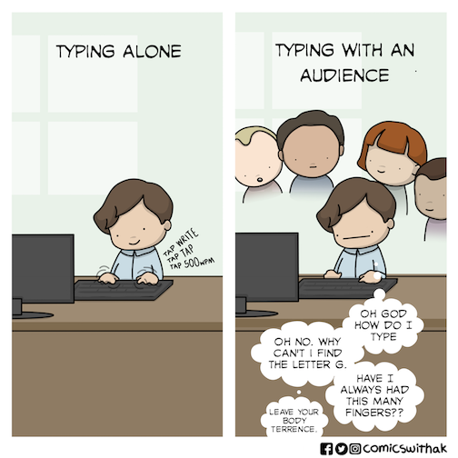
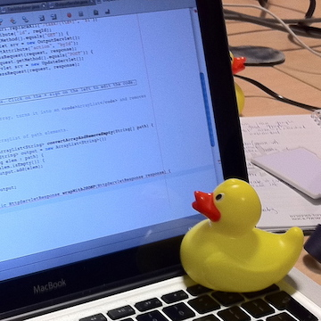

```{r setup, include=FALSE}
knitr::opts_chunk$set(echo = TRUE)
```

Set your working directory here:
```{r}
#setwd()
```

***

## Outline for today:
1. A peek at GitHub 
2. Walk through [Statistical Thinking for the 21st Century Chapter 1: Introduction to R](https://statsthinking21.github.io/statsthinking21-R-site/introduction-to-r.html)
3. Try it out! Mini-exercises
4. Time for general questions/comments (*heads up, may ask everyone to come up with 1 thing!*)

***

### Probably how I will be during these sessions please forgive me :)

***

## 1. A peek at GitHub

### GitHub

**Some resources that give an introduction to git and GitHub:**

- [Software Carpentry: Version control with git](http://swcarpentry.github.io/git-novice/)
- [git - the simple guide](https://rogerdudler.github.io/git-guide/)

**Brief explanation of what GitHub is useful for, and take a look at a few random examples:**

- Version control with some of our own CBPD lab scripts
- Russ Poldrack's code for his [stats textbook](https://github.com/statsthinking21/statsthinking21-R)
- [braindr ("like Tinder, for Brains!")](https://github.com/OpenNeuroLab/braindr) https://braindr.us/#/
- More complex neuroimaging analysis pipelines, like [FMRIPREP](https://github.com/poldracklab/fmriprep) - written in Python
- Can also use for storing documents, not just code: [NeuroMatch Academy](https://github.com/NeuromatchAcademy/course-content)

***

## 2. Walk through textbook chapter

We will be working through Dr. Russell Poldrack's learning resource, Statistical Thinking for the 21st Century (R companion), starting with [Chapter 1: Introduction to R](https://statsthinking21.github.io/statsthinking21-R-site/introduction-to-r.html)

### 1.1 Why programming is hard to learn

- It can be daunting at the beginning (it was for me!!), and that's totally normal and ok. Practice makes perfect!
- Debugging
    - Google is your friend! Tip: try copy/pasting your error messages
    - Rubber duck debugging



 
***

### 1.2 Using RStudio

- Interface for viewing your data, plots, etc. more easily
- Can use to make R Markdown notebooks, which we are using today (but can also make regular R scripts)
- [R Markdown cheat sheet](https://rstudio.com/wp-content/uploads/2015/02/rmarkdown-cheatsheet.pdf)

***

### 1.3 Getting started with R

- Using R like a fancy calculator
- Types of variables: integers (1, 2), real numbers (1.3, 2.788), character strings ("Cats", "Dogs"), logicals (TRUE, FALSE), etc.
- Can convert between types of variables

```{r}
# Your code here
```

***

### 1.4 Variables

- Assigning variables so you can use them in other operations! Key concept in programming

```{r}
# Your code here
```

***

### 1.5 Functions

- Functions: taking inputs and giving outputs
- R has a variety of built-in/default functions (e.g., sum(), max(), typeof(), length()) - how to learn more about these functions
- Understanding arguments of a function

```{r}
# Your code here
```

Example functions I use frequently:

```{r}

# Calculate the Z-score of a data column
zscore <- function(column){
  col_mean <- mean(column, na.rm=TRUE)
  col_sd <- sd(column, na.rm=TRUE)
  col_z <- (column - col_mean)/col_sd
  return(col_z)
}

# Calculate a composite SES variable from parent education and income
calc_ses_both <- function(df){
  df$ses_income_z <- zscore(df$income_median)
  df$parent2_edu[df$parent2_edu==0] <- NA   # 0 not an accurate option for parent 2 edu, so changing to NA
  df$ses_parent_edu <- rowMeans(df[c('parent1_edu', 'parent2_edu')], na.rm=TRUE)
  df$ses_parent_edu_z <- zscore(df$ses_parent_edu)
  df$ses_both <- rowMeans(df[c('ses_income_z', 'ses_parent_edu_z')], na.rm=TRUE)
  df$ses_income_z <- NULL; df$ses_parent_edu_z <- NULL
  return(df)
}
```

***

### 1.6 Vectors

- When we work with data in R, it takes the form of vectors
- Understand indexing

```{r}
# Your code here
```

***

### 1.7 Math with Vectors

- Can perform mathematical operations on vectors
- Logical operations are another important tool (e.g., using logical operations to index your data)

```{r}
# Your code here
```

***

### 1.8 Data Frames

- The major way you would interact with data from spreadsheets

```{r}
# Your code here
```

***

### 1.9 Using R Libraries

```{r}
# Your code here
```

Some sample code for making a fancier histogram of age

```{r eval = FALSE}
df$age_scan_int <- as.integer(df$age_scan)

ggplot(df, aes(x=age_scan_int)) +
  geom_histogram(color="black", fill="gray92", binwidth=1) + scale_x_continuous(breaks = seq(4, 9, by = 1), limits=c(3.5,9.5)) +
  theme(axis.text=element_text(size=20), axis.title=element_text(size=28),
        panel.grid.major = element_blank(), panel.grid.minor = element_blank(),
        panel.background = element_blank(), axis.line = element_line(colour = "black", size=.5), legend.title = element_blank(), 
        legend.text=element_text(size=18)) + labs(x = "Age at Scan (years)") + scale_y_continuous(breaks = seq(0, 35, by = 5), limits=c(0,35))
```

### 1.10 Working with Data Files

```{r}
# Your code here
```

***

## 3. Try it out! Mini-exercises

**Read in the lab sample data into RStudio, assign to a variable**

```{r}
# Your code here
```

**First let's plot a simple histogram of age together**

```{r}
# Your code here
```

**Make a new data frame that drops all the longitudinal subjects**

```{r}
# Your code here
```

- How to generate a quick summary of a data column (like mean, min, max, etc.)

**What about if you only wanted to look at 4-to-5-year-olds in the sample, or only kids who were scanned?**

```{r}
# Your code here
```

- I have planted a problem in the "parent2_edu" column (a real issue we encountered previously!) - can you find it?

**Plot a histogram of family income**

```{r}
# Your code here
```

**Make a factor variable from age at scan**

```{r}
# Your code here
```

**Bonus! Can you figure out how to use the functions given above? zscore and calc_ses_both**

```{r}
# Your code here
```


#### You guys right now :)


***

## 4. Time for general questions/comments

**Notes:**

```{r}
# Your code here
```
